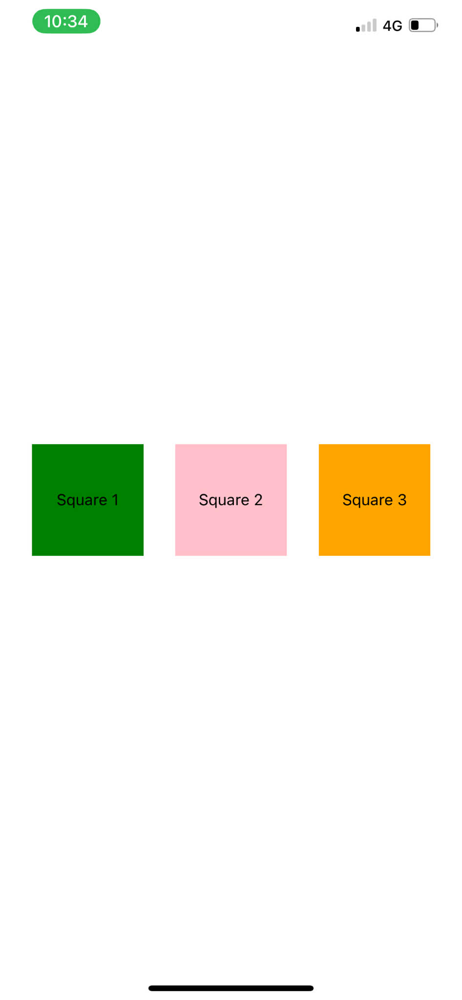

# BÀI THỰC HÀNH 4.2

## Thông tin sinh viên

- **Họ và tên**: Bàn Bình Dương
- **Mã sinh viên**: 23810320382
- **Lớp**: D18CNPM4
- **Môn học**: Lập trên thiết bị di động
- **Buổi**: Buổi 04
- **Bài tập**: Bài thực hành 4.2

---

## Hình ảnh kết quả chạy chương trình

### Giao diện màn hình

