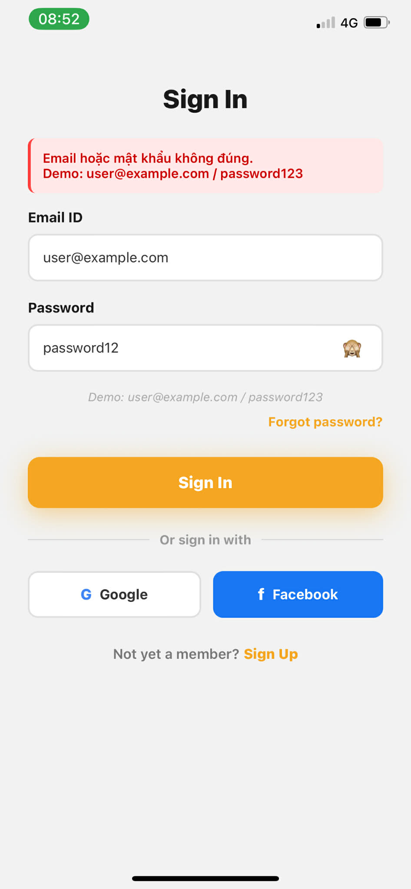
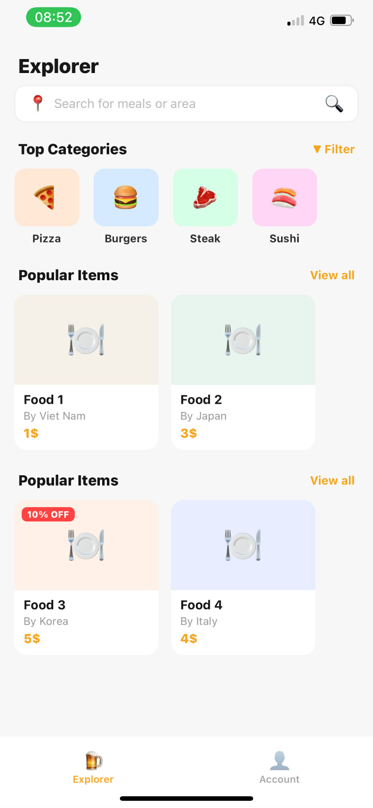
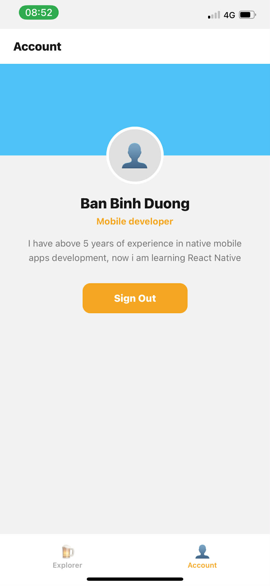

# BÀI THỰC HÀNH 8.1

## Thông tin sinh viên

- **Họ và tên**: Bàn Bình Dương
- **Mã sinh viên**: 23810320382
- **Lớp**: D18CNPM4
- **Môn học**: Lập trên thiết bị di động
- **Buổi**: Buổi 09
- **Bài tập**: Bài thực hành 8.1 ngày 12/3

---

## Hình ảnh kết quả chạy chương trình

### Giao diện màn hình

